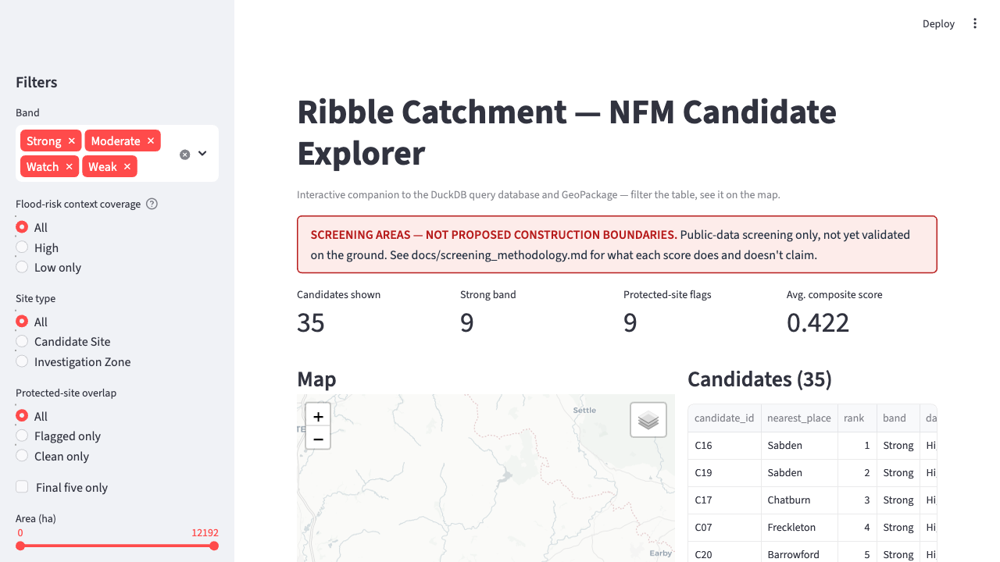
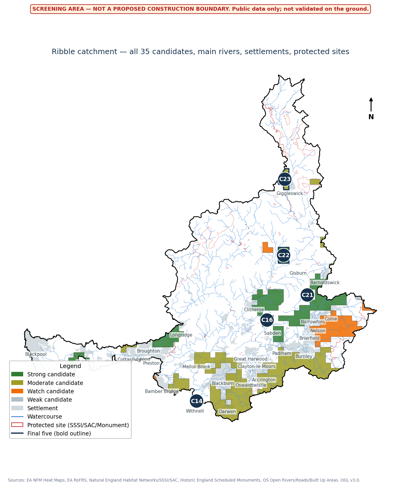

# Ribble Catchment Natural Flood Management Screening

A data-led screening project to find candidate natural flood management (NFM)
sites in the River Ribble catchment (Lancashire) — combining national EA and
Natural England datasets with Ordnance Survey context data, validated against
local practitioner knowledge.

Full project brief: [Natural_Flood_Management_Candidate_Sites_Project_Overview.docx](Natural_Flood_Management_Candidate_Sites_Project_Overview.docx)


*The interactive Streamlit explorer - filters drive both the map and the table live. (Map shown here is the base layer only; candidate polygons render when you run it yourself - see below.)*


*All 35 screened candidates, banded by score, with protected sites and the final five outlined.*

## Installation

**Requires Python 3.10+.** This was built and tested against Python 3.13
(via Miniconda) and independently verified in a **clean Python 3.14 venv**
with no relation to the dev environment - `geopandas`/`pyogrio` specifically
need 3.10+; the plain macOS system Python (3.9) will fail to install them.

```bash
git clone <this-repo>
cd "Risk Analyst"
python3 --version          # confirm 3.10+
python3 -m venv .venv
source .venv/bin/activate  # Windows: .venv\Scripts\activate
pip install -r requirements.txt
```

For running tests too:

```bash
pip install -r requirements-dev.txt
pytest tests/ -v
```

**You don't need to rebuild the whole pipeline to explore results.**
`data/processed/candidate_longlist.csv`, `candidate_longlist.gpkg`, and
`ribble_nfm.duckdb` are committed to this repo specifically so a fresh clone
can immediately run the notebook, the app, and the tests - everything else in
`data/` (raw downloads, the 644MB staging GeoPackage) is gitignored and only
needed if you want to rebuild from source; see "Reproducing the pipeline"
below.

```bash
streamlit run app/streamlit_app.py            # interactive explorer
jupyter notebook notebooks/explore_candidates.ipynb  # SQL walkthrough
duckdb data/processed/ribble_nfm.duckdb        # raw SQL access
```

## Status

| Week | Task | Status |
|---|---|---|
| 1 | Select catchment; acquire and catalogue data | Done |
| 2 | Build validated spatial staging layers | Done |
| 3 | Screening features and initial ranking | Done |
| 4 | Manual review and map production | Done |
| 5 | Practitioner outreach and validation | Outreach materials ready; response pending |
| 6 | Revise analysis and publish case study | In progress — case study, executive briefing, DuckDB database, notebook, and Streamlit explorer all built; final revision pending Week 5 feedback |

## Repository structure

```
data/raw/          Original downloads, untouched (gitignored - see docs/provenance_manifest.csv)
data/interim/       Intermediate files (catchment boundary reprojections)
data/processed/     Spatial database + DuckDB (mostly gitignored - 3 sample outputs kept, see Installation)
scripts/            Every pipeline step, in order (see below)
docs/               Methodology, data dictionary, provenance manifest, review notes, README assets
outputs/            Maps, site cards, outreach materials
notebooks/          SQL analysis walkthrough (DuckDB)
app/                Interactive Streamlit explorer
tests/              pytest suite - pure scoring logic + checks against the committed sample data
.github/workflows/  CI - runs the test suite on push/PR
```

The interactive explorer's filters (band, flood-risk context coverage, site
type, protected-site overlap, area, final five, place search) drive both the
map and the table live - see the screenshot at the top of this file.

## Testing

```bash
pip install -r requirements-dev.txt
pytest tests/ -v
```

20 tests: pure scoring-logic unit tests (percentile ranking, banding, weight
sums, the site-card text helpers that once had a real capitalisation bug)
plus checks against the committed sample data (schema, row counts, the exact
example query from `docs/query_database.md`). CI (`.github/workflows/tests.yml`)
runs this on every push/PR against Python 3.11 and 3.12.

## Reproducing the pipeline

Each step rebuilds from the one before it, entirely from retained raw files:

```bash
python3 scripts/build_staging_layers.py     # Week 2: reproject, clip, validate -> data/processed/ribble_nfm_staging.gpkg
python3 scripts/score_candidates.py         # Week 3: screening factors + ranked longlist -> data/processed/candidate_longlist.gpkg/.csv
python3 scripts/build_week4_maps.py         # Week 4: catchment/gap/site maps -> outputs/maps/week4/
python3 scripts/build_site_cards.py         # Week 4: assembles the site-card document
python3 scripts/build_outreach_one_pager.py # Week 5: one-page outreach summary
python3 scripts/build_case_study.py         # Week 6: portfolio case study document
python3 scripts/build_query_database.py     # Week 6: DuckDB tabular query database -> data/processed/ribble_nfm.duckdb
python3 scripts/build_executive_briefing.py # Week 6: two-page briefing for a flood-risk/insurance/nature-finance audience
```

`scripts/fetch_ogc_features.py` is a helper used during Week 1 acquisition
(EA/Natural England OGC API bbox queries) — not part of the rebuild chain,
since raw downloads are retained rather than re-fetched.

## Key documents

- [docs/scope_note.md](docs/scope_note.md) — catchment selection rationale
- [docs/provenance_manifest.csv](docs/provenance_manifest.csv) — every dataset: source, licence, date, known gaps
- [docs/data_dictionary.md](docs/data_dictionary.md) — every staging layer, its schema, and validation results
- [docs/screening_methodology.md](docs/screening_methodology.md) — the six-factor scoring framework, weights, sensitivity analysis
- [docs/week4_manual_review.md](docs/week4_manual_review.md) — how the longlist was narrowed to five site cards, and why
- [docs/insight_briefing.md](docs/insight_briefing.md) — findings, limitations, recommended next checks (pre-validation draft)
- [docs/query_database.md](docs/query_database.md) — the DuckDB query database: tables, views, example SQL
- [notebooks/explore_candidates.ipynb](notebooks/explore_candidates.ipynb) — five worked SQL questions with explanations

## Outputs (outputs/)

- `Ribble_NFM_Candidate_Site_Cards.docx` — catchment overview, opportunity-gap map, five site cards (map + evidence panel each, kept together on one page)
- `Ribble_Outreach_One_Pager.docx` — genuinely one page, for a named Ribble Rivers Trust contact
- `Ribble_NFM_Executive_Briefing.docx` — two pages, for a flood-risk/insurance/nature-finance audience
- `Ribble_NFM_Portfolio_Case_Study.docx` — architecture, controls, findings, reflection

Every polygon in every output is explicitly labelled a screening area, not a
proposed construction boundary — on the maps themselves (a banner baked into
each image) and in each document's text.

## Known limitations (see docs/provenance_manifest.csv and docs/screening_methodology.md for detail)

- RoFRS (flood-risk) data has no vector/bbox API; acquired via 12 manual portal exports, reaching 98.8% catchment coverage. It's reported per-candidate as context, not scored (see docs/screening_methodology.md for why).
- SSSI/SAC/Scheduled Monument data was added after an initial gap; 9 of 35 candidates overlap a protected site and are flagged explicitly.
- "Nearby community exposure" (renamed from "downstream exposure") is settlement proximity plus recorded historic flood overlap, not verified hydrological flow direction.
- Candidates ≥1,000ha are labelled "Investigation Zone" rather than "Candidate Site" and excluded from the site-card selection - not split, since no real sub-parcel data exists to do that defensibly.
- The candidate ranking is not yet validated against local practitioner knowledge (Week 5 in progress).

## Licence

Code: [MIT](LICENSE). Data: [Open Government Licence v3.0](https://www.nationalarchives.gov.uk/doc/open-government-licence/version/3/) - see `docs/provenance_manifest.csv` for the source and licence of every dataset used.
